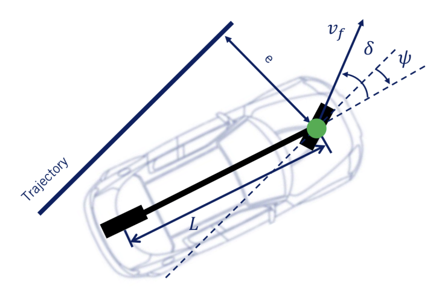

**Oryginalna dokumentacja repozytorium:**
[Original README](docs/README.md)

## Spis treści
1. [Opis projektu](#opis-projektu)
2. [Przygotowanie środowiska symulacyjnego](#przygotowanie-środowiska-symulacyjnego)
3. [Implementacja algorytmu sterowania](#implementacja-algorytmu-sterowania)
4. [Algorytm detekcji znaków](#algorytm-detekcji-znaków)
5. [Uruchomienie](#uruchomienie)
6. [Przydatne komendy / informacje](#przydatne-komendy--informacje)

## Opis projektu
Projekt miał na celu zaprojektowanie i implementację autonomicznego samochodu działającego w środowisku symulacyjnym ROS + Gazebo. W ramach projektu stworzono system umożliwiający pojazdowi samodzielne poruszanie się po drodze, wykrywając i interpretując elementy otoczenia na podstawie obrazu z kamery. Algorytm analizuje obraz z kamery zamontowanej na samochodzie, aby wykrywać linię na środku jezdni. Na tej podstawie samochód dynamicznie wyznacza trajektorię ruchu, utrzymując się w granicach wyznaczonego pasa. Detekcja znaków drogowych odbywała się za pomocą wytrenowanej wcześniej sieci neuronowej, dzięki czemu system jest w stanie rozpoznać różne znaki, takie jak ograniczenia prędkości, znaki stopu czy ostrzeżenia.

## Przygotowanie środowiska symulacyjnego
W projekcie zostały wykorzystane projekty gotowy znaleziony w internecie:

- [Nathan Benson Park](https://app.gazebosim.org/OpenRobotics/fuel/models/nathan_benderson_park) - Gotowy świat zawierający układ miasta z drogami z teskturami pasów.

- [Prius](https://app.gazebosim.org/OpenRobotics/fuel/models/Prius%20Hybrid%20with%20sensors) - Model pojazdu, który będzie testowany. 

- [Znak Stop](https://app.gazebosim.org/OpenRobotics/fuel/models/Stop%20Sign) - Model znaku, który posłużył jako model tekstury, w którym zmieniano grafikę, aby stworzyć inne znaki.

Wczytanie świata następuje w pliku custom_city.sdf w następujący sposób:
```bash
<include> 
  <uri> 
    model://nathan_benderson_park 
  </uri> 
</include>
```

W ten sposób, odnosimy się do lokalizacji modelu samego modelu miasta, które zostało przez nas zmodyfikowane. Każda tekstura wczytywana jest w ten sam sposób, podając jej siatkę punktów, w których ma się znaleźć, teksturę oraz inne parametry takie jak fizyczną kolizję z innymi elementami otoczenia: 

```bash
<visual name="Road_visual"> 
                <geometry> 
                    <mesh> 
                        <uri>meshes/nb_park.dae</uri> 
                        <submesh> 
                            <name>Road</name> 
                            <center>false</center> 
                        </submesh> 
                    </mesh> 
                </geometry> 
                <material> 
                    <diffuse>1.0 1.0 1.0</diffuse> 
                    <specular>0.06 0.06 0.06</specular> 
                    <pbr> 
                        <metal> 
                            <albedo_map>materials/textures/Road_Albedo.png</albedo_map> 
                            <normal_map>materials/textures/Road_Normal.png</normal_map> 
                            <roughness_map>materials/textures/Road_Roughness.png</roughness_map> 
                            <environment_map>materials/textures/EnvMap.dds</environment_map>
                        </metal> 
                    </pbr> 
                </material> 
            </visual>  
```
Do mapy również dodano znaki, tak aby przybrały możliwie realne rozmieszczenie znaków w mieście. Wśród dodanych znaków są: 

- Znak stopu 
- Znaki dopuszczalnej prędkości 
- Nakazy jazdy, skrętu 
- Znaki pierwszeństwa 
- Znak przejścia dla pieszych 

Znaki są wczytywane w ten sam sposób jak mapa oraz zmienione, tak aby miały różne grafiki. 

```bash
<include> 
      <uri>model://models/Signs/Priority_sign</uri> 
      <name>Priority Sign</name> 
      <pose>-134.9530029296875 973.00592041015625 5 0 0 0</pose> 
    </include> 
 
<?xml version="1.0" ?> 
<sdf version="1.5"> 
  <model name="Priority Sign"> 
    <static>true</static> 
    <link name="link"> 
      <collision name="collision"> 
        <geometry> 
          <mesh> 
            <scale>10 10 10</scale> 
            <uri>model://models/Signs/Priority_sign/meshes/priority_sign.dae</uri> 
          </mesh> 
        </geometry> 
      </collision> 
      <visual name="visual"> 
        <geometry> 
          <mesh> 
            <scale>10 10 10</scale> 
            <uri>model://models/Signs/Priority_sign/meshes/priority_sign.dae</uri> 
          </mesh> 
        </geometry> 
      </visual> 
    </link> 
  </model> 
</sdf> 
```
Ważnym elementem jest podanie poprawnej ścieżki do mapy punktów modelu określonym w sekcji <uri> i podanie niej odpowiedniej grafiki:

```bash
<image id="Speed_30_tga">
      <init_from>../materials/textures/priority.png</init_from>
</image> 
```
Model samochodu nie został w żaden sposób zmodyfikowany, tylko wczytany wprost z pliku wraz z określeniem miejsca, w którym ma się pojawiać na mapie względem centrum.

## Implementacja algorytmu sterowania
W projekcie do sterowania pojazdem wykorzystano kontroler Stanleya. Jest to jeden z popularnych algorytmów używanych do sterowania autonomicznymi pojazdami. Jego głównym celem jest minimalizacja odchylenia pojazdu od zaplanowanej trajektorii oraz utrzymanie poprawnej orientacji pojazdu względem tej trajektorii.



Kontroler Stanley został zaimplementowany jako część funkcji motion_controller. Algorytm wykorzystuje bieżący stan pojazdu oraz punkty trajektorii do obliczenia kąta skrętu i wysyłania odpowiednich komend prędkości do pojazdu.

```bash
def motion_controller(self, waypoints=None, target_vel=0.0):
    if waypoints is not None:
        c_x = waypoints[0]
        c_y = waypoints[1]
        c_yaw = waypoints[2]

        delta, self.target_idx = stanley_control(self.state, c_x, c_y, c_yaw, self.target_idx)
        # turningRadius = L * np.tan(delta)
        turningRadius = L / np.sin(delta)
        target_yaw_rate = self.state.v / turningRadius

        self.send_setpoints(target_vel, target_yaw_rate)

        delta_conv = np.sign(delta)*(90 - np.rad2deg(np.abs(delta)))
        self.get_logger().info(f"v: {target_vel}, delta: {delta_conv}")
    else:
        target_yaw_rate = 0.0
        self.send_setpoints(target_vel, target_yaw_rate)
```

Kluczowe kroki:
- Obliczenie kąta skrętu 𝛿: Funkcja stanley_control wyznacza kąt skrętu na podstawie bieżącego stanu pojazdu oraz trajektorii.
- Wyznaczenie prędkości kątowej: Prędkość kątowa 𝜓' jest zależna od prędkości liniowej pojazdu 𝑣 oraz promienia skrętu.
- Publikacja komend: Komendy prędkości liniowej i kątowej są wysyłane do napędu pojazdu za pomocą ROS /cmd_vel.

Trajektoria jest interpolowana za pomocą funkcji calc_spline_course z biblioteki cubic_spline_planner. Algorytm generuje punkty trajektorii oraz odpowiadające im kąty orientacji:

```bash
c_x, c_y, c_yaw, _, _ = cubic_spline_planner.calc_spline_course(x, y, ds=0.1)

self.waypoints = (c_x, c_y, c_yaw)
self.target_idx, _ = calc_target_index(self.state, c_x, c_y)

self.state.x = 0.0
self.state.y = 0.0
self.state.yaw = 0.0
```

## Algorytm detekcji znaków
Algorytm detekcji znaków drogowych został zaprojektowany w celu identyfikacji znaków na obrazie z kamery przedniej pojazdu. Proces obejmuje wykrywanie obszarów z potencjalnymi znakami drogowymi, klasyfikację ich na odpowiednie kategorie oraz przekazywanie wyników w czasie rzeczywistym.

Przed analizą obraz jest konwertowany z formatu ROS na format zgodny z OpenCV przy użyciu biblioteki cv_bridge:

```bash
frame = self.bridge.imgmsg_to_cv2(msg, desired_encoding="bgr8")
```

Zidentyfikowane obszary są klasyfikowane przy użyciu wczytanego, wcześniej wytrenowanego modelu sieci neuronowej:

```bash
self.model = tf.saved_model.load(
    "/home/developer/ros2_ws/src/autonomous_vehicle/autonomous_vehicle/good_model")
```

Przed klasyfikacją, fragment obrazu jest przetwarzany:

- Skalowanie do wymiaru 30x30 pikseli.
- Normalizacja wartości pikseli do zakresu [0, 1].
- Dodanie wymiaru dla batcha.

Model zwraca etykietę oraz poziom pewności:

```bash
output = self.model.signatures["serving_default"](input_tensor)
predictions = output["output_0"].numpy()
pred = np.argmax(predictions, axis=1)[0]
confidence = np.max(predictions)
```

Dopasowana etykieta jest pobierana z predefiniowanego słownika:

```bash
sign = self.class_labels[pred + 1]
```

## Uruchomienie
Po sklonowaniu repozytorium i zbudowaniu dockera należy wykonać poniższe komendy.

Zbudowanie paczek:
```bash
colcon build --symlink-install
colcon build --packages-select autonomous_vehicle
```

Uruchomienie środowiska:
```bash
source install/setup.bash
```

Uruchomienie pliku launch:
```bash
ros2 launch autonomous_vehicle/launch/auto.launch.py
```

Uruchomienie pliku node do wyświetlania obrazów z kamer:
```bash
ros2 run autonomous_vehicle helper_node
```

## Przydatne komendy / informacje:
Bridge ROS-Gazebo:
```bash
ros2 run ros_gz_bridge parameter_bridge --ros-args -p config_file:=ros_gz_bridge.yaml
```
Ścieżka do modeli gazebo pobieranych z internetu:
```bash
$HOME/.gz/fuel/
```
RViz:
```bash
ros2 run rviz2 rviz2
```
Przy wizualizacji chmury punktów lidaru trzeba to umieścić w "Global Options / Fixed Frame"
```bash
prius_hybrid_sensors/sensors/center_laser_sensor
```
